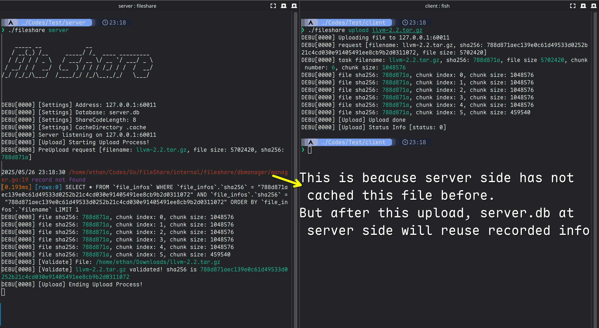
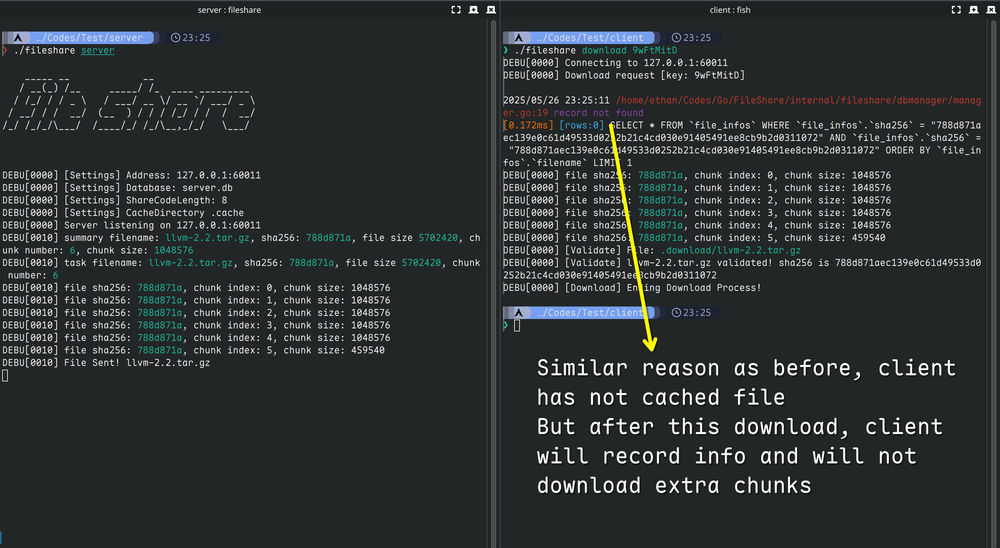
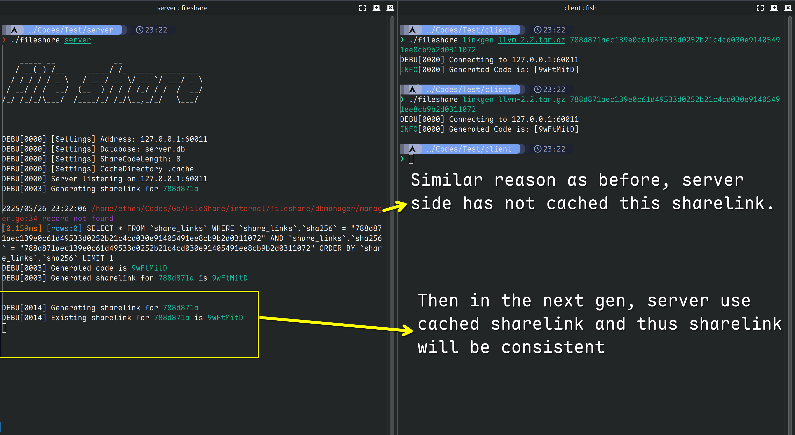
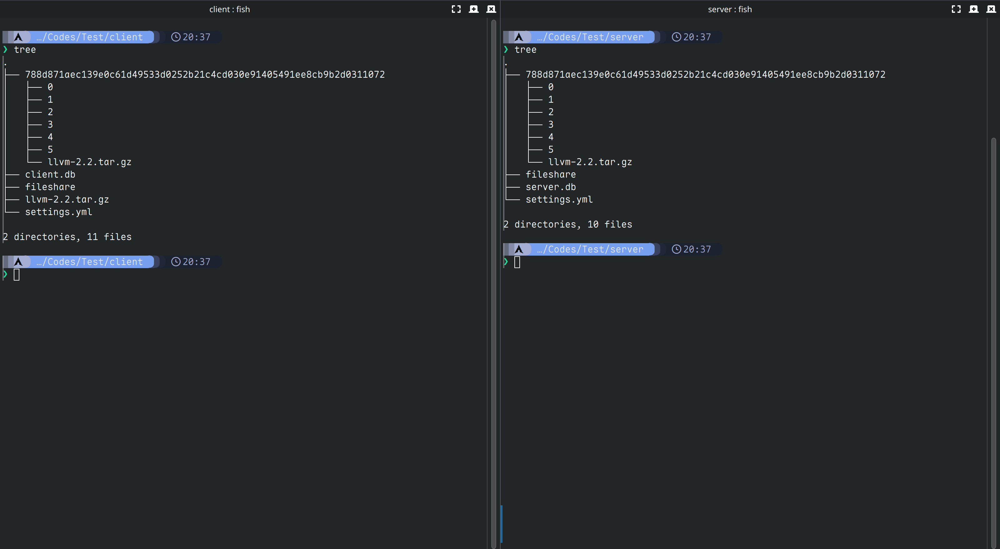
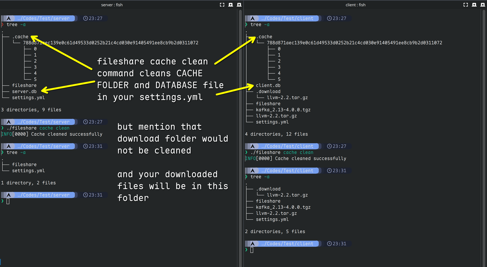

# Fileshare is a lightweight, grpc based centralized file server
Fileshare is designed for lightweight file server. Grpc is used for fast transfer.

Fileshare auto check the validity of the file transferred.

On both server and client side, both download and upload, **fileshare** will check the `sha256sum` value automatically

Fileshare also provides web api for monitoring sqlite data, see examples below

Fileshare monitors upload, linkgen, download actions at server side,

# How to use?
Each fileshare needs a `settings.yml` file in the `same folder with fileshare`, which should contains below parts

``` yaml
grpc_address: 0.0.0.0:60011
web_address: 0.0.0.0:8080
database: server.db
share_code_length: 8
cache_directory: .cache
download_directory: .download
certs_path: certs
valid_days: 30
blocked_ips:
  - 127.0.0.1
```

## Configuration files explained

- for `grpc address` and `web address`, make sure that client and server has same ip address that can be accessed
- for database, just make sure the parent directory of xxx.db exists
    - for example, `client/client.db` just need to make sure `client` exists
- for share_code_length, make sure this is `not set` to the default length of sha256 (which is 64 by default)
- for cache_directory, cache file chunks. if not set, then use `$HOME/.fileshare`
- for download_directory, where download file is stored. if not set, then use `$HOME/Downloads`
- for valid_days: set the default valid days for a share link, if not set, then default is `7`, lives for a week
- for blocked_ips, all requests from this ip addr will be blocked

### Examples
#### Server
Notice that share_code_length `cannot` be set to the length of the size of sha256, which is `64`
``` yaml
# config for server/settings.yml
grpc_address: 0.0.0.0:60011
web_address: 0.0.0.0:8080
database: server.db

# this config determines the length of sharelink code
# any length is ok, except the fixed size of sha256, which is 64
share_code_length: 8
cache_directory: .cache
download_directory: .download

# below configurations are server side only
certs_path: certs
valid_days: 30
blocked_ips:
  - 127.0.0.1
```

#### Client
``` yaml
# config for client/settings.yml
grpc_address: 0.0.0.0:60011
web_address: 0.0.0.0:8080
database: client.db
share_code_length: 8
cache_directory: .cache
download_directory: .download
```

## LinkCode generating:
### Exciting ability introduced! If u wanna share a file with your friends, you can generate linkcode by doing this:

#### Below command will generate a linkcode like

``` sh
fileshare linkgen llvm-2.2.tar.gz 788d871aec139e0c61d49533d0252b21c4cd030e91405491ee8cb9b2d0311072
```

``` sh
INFO[0000] Generated Code is: [fzHghSyr]
```

## Example Structures
below is a example structure of client and server structure
```
.
├── client
│   ├── client.db
│   ├── fileshare
│   ├── kafka_2.13-4.0.0.tgz
│   ├── llvm-2.2.tar.gz
│   └── settings.yml
└── server
    ├── fileshare
    ├── server.db
    └── settings.yml

3 directories, 8 files
```

## Example Usages
### Upload


### Download


### LinkGen


### Final Structure be like:


### Cache Clean


### Cmd usages:

#### Server
``` sh
fileshare server
```

#### Client Upload
``` sh
fileshare upload llvm-2.2.tar.gz
```

#### Client Download
- Use the linkcode shared by your friends, and download with this code is ok!
``` sh
fileshare download fzHghSyr
```

- Optional Usages: Notice that `following hash` is the `checksum` of the file using **sha256sum**
``` sh
fileshare download 788d871aec139e0c61d49533d0252b21c4cd030e91405491ee8cb9b2d0311072
```

#### Client Gen Code
Notice that the parameters are `filename` `checksum256`
``` sh
fileshare linkgen llvm-2.2.tar.gz 788d871aec139e0c61d49533d0252b21c4cd030e91405491ee8cb9b2d0311072
```

#### Client / Server clean cache
Clean cache command can be used both at server and client
``` sh
fileshare cache clean
```
## Using Docker?
First download `fileshare.docker.zip` from releases and import this zip file to your docker

And download binary from `fileshare.tar.gz`, extract to fileshare

Then run following commands:
``` sh
docker run -d --name fileshare -p 60011:60011 -p 8080:8080 fileshare:0.1.4
```
