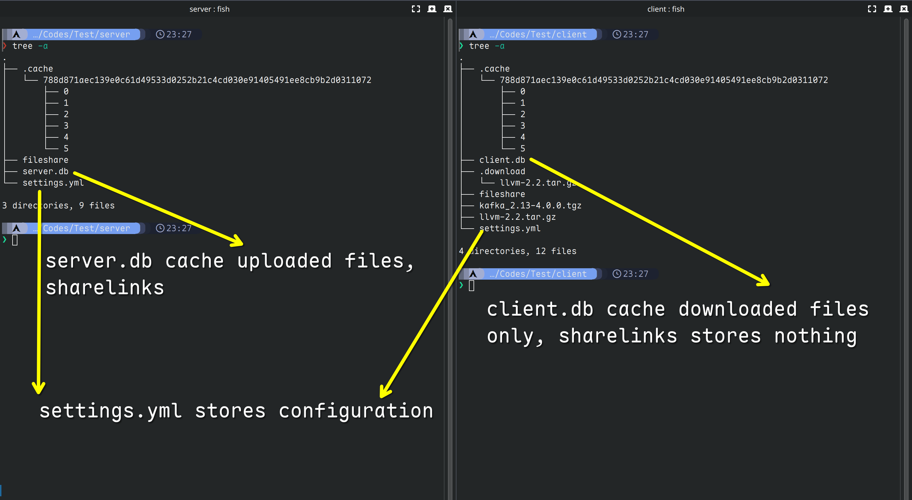

# Fileshare is a lightweight, grpc based centralized file server
Fileshare is designed for lightweight file server. Grpc is used for fast transfer.

Fileshare auto check the validity of the file transferred.

On both server and client side, both download and upload, **fileshare** will check the `sha256sum` value automatically

# How to use?
Each fileshare needs a `settings.yml` file in the `same folder with fileshare`, which should contains below parts

``` yaml
address: 127.0.0.1:60011
database: client/client.db
```

- for address, make sure that client and server has same ip address that can be accessed
- for database, just make sure the parent directory of xxx.db exists
    - for example, `client/client.db` just need to make sure `client` exists

## Example Structures
below is a example structure of client and server structure
```
.
├── client
│   ├── client.db
│   ├── fileshare
│   ├── llvm-2.2.tar.gz
│   └── settings.yml
└── server
    ├── fileshare
    ├── server.db
    └── settings.yml

3 directories, 8 files

```

## Configuration files Example

#### Server
Notice that share_code_length `cannot` be set to the length of the size of sha256, which is `64`
``` yaml
# config for server/settings.yml
address: 127.0.0.1:60011
database: server.db
# this config determines the length of sharelink code
# any length is ok, except the fixed size of sha256, which is 64
share_code_length: 8
```

#### Client
``` yaml
# config for client/settings.yml
address: 127.0.0.1:60011
database: client.db
```

## LinkCode generating:
### Exciting ability introduced! If u wanna share a file with your friends, you can generate linkcode by doing this:

``` sh
# this command will generate a linkcode like
# INFO[0000] Generated Code is: [fzHghSyr]
fileshare linkgen llvm-2.2.tar.gz 788d871aec139e0c61d49533d0252b21c4cd030e91405491ee8cb9b2d0311072

fileshare download fzHghSyr
```

## Example cmd usages:

#### Server
``` sh
fileshare server
```

#### Client Upload
``` sh
fileshare upload llvm-2.2.tar.gz
```

#### Client Download
- Use the linkcode shared by your friends, and download with this code is ok!
``` sh
fileshare download fzHghSyr
```

- Optional Usages: Notice that `following hash` is the `checksum` of the file using **sha256sum**
``` sh
fileshare download 788d871aec139e0c61d49533d0252b21c4cd030e91405491ee8cb9b2d0311072
```

#### Client Gen Code
Notice that the parameters are `filename` `checksum256`
``` sh
fileshare linkgen llvm-2.2.tar.gz 788d871aec139e0c61d49533d0252b21c4cd030e91405491ee8cb9b2d0311072
```

#### Client / Server clean cache
Clean cache command can be used both at server and client
``` sh
fileshare cache clean
```


## Using Docker?
First download `fileshare.docker.zip` from releases and import this zip file to your docker

And download binary from `fileshare.tar.gz`, extract to fileshare

Then run following commands:
``` sh
docker run -d --name fileshare -p 60011:60011 fileshare:0.1.2.2
```

# Pictures
## Upload

## Download


## Final Structure be like:

