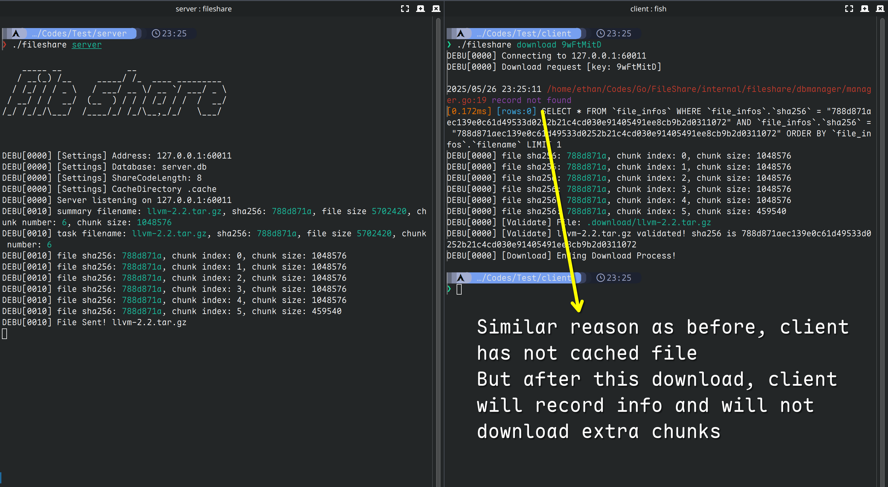

# Fileshare是一款轻量的基于grpc的中心式文件服务器

[英文文档](../../README.md)

Fileshare设计之初就是为了轻量，grpc是为了让传输更块

Fileshare 还会自动检查文件的有效性，不论在客户端和服务端，是下载还是上传，**fileshare**都会自动检查`sha256`

Fileshare还会在服务侧记录所有的上传，下载和链接生成的动作，让管理员可以总览服务器记录

Fileshare同时提供了web接口用于监管sqlite存储的数据，详情参照[下文示例](#示例输出)

# fileshare的一些特点
## 可以个人搭建的文件服务器，容易部署
fileshare在release界面有打包好的镜像，使用docker可以很轻松的部署

## 相较于传统的网盘服务，fileshare是一个无状态的服务
服务端会自动记录`你已经上传的部分文件`，并且存储到数据库，下一次传输的时候，服务端会只要求那些`缺失的部分`

相较于http的range字段，fileshare可以随时重新断线重联，你可以在你想要的任何时候重新上传，并且不会造成流量的浪费

## 为什么我选用protobuf和grpc?


**使用grpc来管理流式传输非常轻松。并且proto不会对流量造成很大影响，`相比于原始数据块大约多用了0.0035%的流量`**

**并且我们观察到，json相比proto的序列化要多用33%的大小。使用proto可以节省流量，加快传输过程**

# 该怎么使用?
每个fileshare都需要一个处于`和fileshare同目录`的`settings.yml`，这个文件应该包含如下部分：

``` yaml
grpc_address: 0.0.0.0:60011
web_address: 0.0.0.0:8080
database: server.db
share_code_length: 8
cache_directory: .cache
download_directory: .download
certs_path: certs
valid_days: 30
blocked_ips:
  - 127.0.0.1
```

## 对配置文件的解释

- 对于 `grpc address` and `web address`，要保证客户端和服务端监听的ip地址相同并且可访问
- 对于 `database`, 只需要保证xxx.db的父级目录存在即可
    - 举个栗子, `client/client.db`只需要保证`client`存在即可
- 对于 `share_code_length`, 保证这个值`不要`被设置成sha256的默认长度（默认是64）
- 对于 `cache_directory`, 存储缓存的文件块的目录。如果没有设置这个值，默认会使用`$HOME/.fileshare`
- 对于 `download_directory`, 存储下载的文件的目录，如果没有设置这个值，默认会使用 `$HOME/Downloads`
- 对于 `valid_days`: 设置分享码的默认有效天数，如果没有设置这个值，默认会使用`7`，也就是一周后过期
- 对于 `blocked_ips`, 所有来自这个ip的请求都会被禁止

### 配置文件的例子
#### 服务端
``` yaml
# config for server/settings.yml
grpc_address: 0.0.0.0:60011
web_address: 0.0.0.0:8080
database: server.db
share_code_length: 8
cache_directory: .cache
download_directory: .download

# 下面的配置项是只有服务端才会用到
certs_path: certs
valid_days: 30
blocked_ips:
  - 127.0.0.1
```

#### 客户端
``` yaml
# config for client/settings.yml
grpc_address: 0.0.0.0:60011
web_address: 0.0.0.0:8080
database: client.db
share_code_length: 8
cache_directory: .cache
download_directory: .download
```

## 分享码如何生成:
### 这是Fileshare令人激动的一个特性，如果你希望将文件分享给你的朋友，你可以通过这么做来生成一个分享码

``` sh
fileshare linkgen llvm-2.2.tar.gz 788d871aec139e0c61d49533d0252b21c4cd030e91405491ee8cb9b2d0311072
```

上面的命令会生成一行输出，见下

``` sh
INFO[0000] Generated Code is: [fzHghSyr]
```

## 文件结构示例
这是客户端和服务端的文件结构示例
```
.
├── client
│   ├── client.db
│   ├── fileshare
│   ├── kafka_2.13-4.0.0.tgz
│   ├── llvm-2.2.tar.gz
│   └── settings.yml
└── server
    ├── fileshare
    ├── server.db
    └── settings.yml

3 directories, 8 files
```

## 使用示例

### 图片示例
#### 上传


#### 下载


#### 分享码生成


#### 最终的目录结构是这样的:


#### 清理缓存


### 命令如何使用:

#### 服务端
``` sh
fileshare server
```

#### 客户端上传
``` sh
fileshare upload llvm-2.2.tar.gz
```

#### 客户端下载
- 使用你朋友分享给你的分享码，使用这个分享码就可以下载了！
``` sh
fileshare download fzHghSyr
```

- 可选的使用方式：下面出现的`哈希值`是文件使用**sha256**生成的`checksum`
``` sh
fileshare download 788d871aec139e0c61d49533d0252b21c4cd030e91405491ee8cb9b2d0311072
```

#### 客户端生成分享码
注意这些参数是`文件名` `文件的checksum256` `有效期`

下面的命令会生成一个有效期为300天的分享码
``` sh
fileshare linkgen llvm-2.2.tar.gz 788d871aec139e0c61d49533d0252b21c4cd030e91405491ee8cb9b2d0311072 300
```

这个命令没有指定有效期，那么服务端会`根据服务端settings.yml的配置项`自动生成有效天数
``` sh
fileshare linkgen llvm-2.2.tar.gz 788d871aec139e0c61d49533d0252b21c4cd030e91405491ee8cb9b2d0311072
```

#### 客户端/服务端清理缓存
清理缓存这个命令可以在服务端和客户端使用
``` sh
fileshare cache clean
```

### Web接口:
``` sh
curl 0.0.0.0:8080/fileinfo
```

``` sh
curl 0.0.0.0:8080/sharelink
```

``` sh
curl 0.0.0.0:8080/record
```
返回值和下面的结构一致:
``` json
{
  "data": [
    ...
  ]
}
```

#### 示例输出
``` json
{
    "data": [
        {
            "Filename": "fileshare",
            "Sha256": "e21645144861413cfd06a268fb3ff6d6a65da0f002034c1667d4607f664faee3",
            "ChunkSize": 1048576,
            "ChunkNumber": 19,
            "FileSize": 19709952,
            "UploadedChunks": "[0,1,2,3,4,5,6,7,8,9,10,11,12,13,14,15,16,17,18]",
            "Link": [
                {
                    "Sha256": "e21645144861413cfd06a268fb3ff6d6a65da0f002034c1667d4607f664faee3",
                    "LinkCode": "DoBsLlwu",
                    "CreatedBy": "172.16.33.118:9837",
                    "CreatedAt": "2025-05-29T13:25:58.7261564+08:00",
                    "OutdatedAt": "2026-03-25T13:25:58.7261564+08:00"
                }
            ],
            "Record": [
                {
                    "Sha256": "e21645144861413cfd06a268fb3ff6d6a65da0f002034c1667d4607f664faee3",
                    "InteractAction": "upload",
                    "ClientIp": "172.16.33.118:9836",
                    "Os": "linux,amd64,ethan-archlinux",
                    "Time": "2025-05-29T13:25:55.6178337+08:00"
                },
                {
                    "Sha256": "e21645144861413cfd06a268fb3ff6d6a65da0f002034c1667d4607f664faee3",
                    "InteractAction": "linkgen",
                    "ClientIp": "172.16.33.118:9837",
                    "Os": "linux,amd64,ethan-archlinux",
                    "Time": "2025-05-29T13:25:58.7405099+08:00"
                },
                {
                    "Sha256": "e21645144861413cfd06a268fb3ff6d6a65da0f002034c1667d4607f664faee3",
                    "InteractAction": "download",
                    "ClientIp": "172.16.33.118:9838",
                    "Os": "linux,amd64,ethan-archlinux",
                    "Time": "2025-05-29T13:26:06.8239799+08:00"
                }
            ]
        }
    ]
}
```

## 使用docker?
首先从github release下载 `fileshare.docker.zip`，然后将这个文件导入docker

然后下载 `fileshare.tar.gz`, 解压为fileshare

接着运行下面的命令:
``` sh
docker run -d --name fileshare -p 60011:60011 -p 8080:8080 fileshare:0.1.4.2
```
